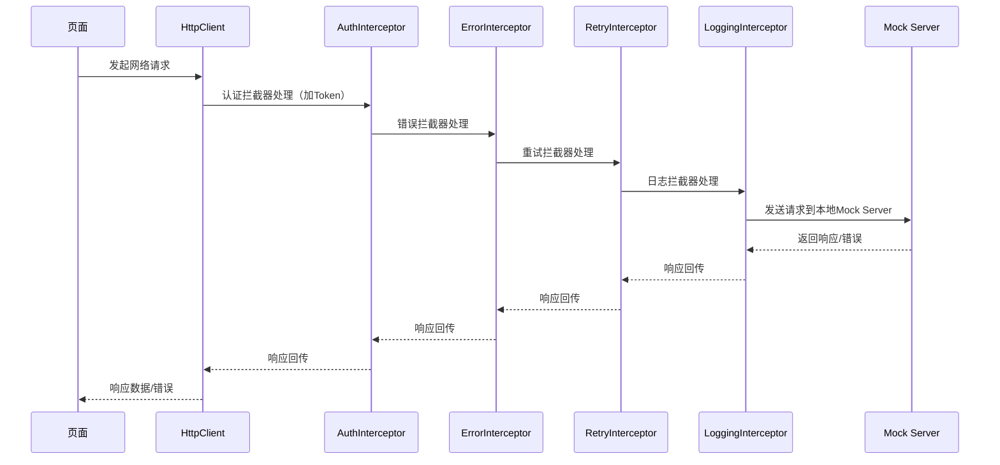

# interceptor_test

一个用于演示 **Dio 拦截器**在 Flutter 项目中实际应用的示例工程，内置本地 Mock Server，支持认证、错误处理、重试、日志等多种拦截器，便于开发和测试网络请求的全流程。

## 项目简介

本项目主要功能和亮点：

- **Dio 拦截器链路**：集成了认证（Auth）、错误处理（Error）、重试（Retry）、日志（Log）四大拦截器，覆盖常见网络场景。
- **本地 Mock Server**：内置 Dart 实现的本地模拟后端，支持登录、文章列表、Token 刷新等接口，方便离线开发和调试。
- **模块化结构**：核心代码分布在 `lib/network`（网络与拦截器）、`lib/pages`（页面）、`lib/models`（数据模型）、`lib/mock_server`（模拟服务）等目录，便于扩展和维护。
- **完整调用链路**：从页面发起请求、拦截器链处理、Mock Server 响应，形成完整的端到端流程。

## 目录结构

```
lib/
  main.dart                // 应用入口，启动 Mock Server
  network/
    http_client.dart       // Dio 客户端及拦截器集成
    interceptor/
      auth_interceptor.dart
      error_interceptor.dart
      retry_interceptor.dart
      log_interceptor.dart
  pages/
    home_page.dart         // 主页，发起网络请求
    login_page.dart        // 登录页
  models/
    article.dart           // 文章数据模型
  mock_server/
    mock_server.dart       // 本地模拟后端服务
```

## 主要技术点与调用时序



1. **应用启动**
   - `main.dart` 启动时会先初始化并启动本地 Mock Server（监听 8080 端口），再运行主应用。

2. **网络请求发起**
   - 页面（如 `home_page.dart`）通过 `HttpClient` 单例发起网络请求（GET/POST/PUT/DELETE）。
   - `HttpClient` 内部集成了四大拦截器，所有请求都会依次经过这些拦截器处理。

3. **拦截器链路**
   - **AuthInterceptor**：自动为请求添加认证 Token，处理 401 错误时清除 Token。
   - **ErrorInterceptor**：统一捕获和处理各种网络错误，输出友好错误信息。
   - **RetryInterceptor**：对网络超时、连接失败等幂等请求自动重试，提升稳定性。
   - **LoggingInterceptor**：开发模式下详细打印请求、响应、错误日志，便于调试。

4. **Mock Server 响应**
   - 所有请求均由本地 `mock_server.dart` 处理，支持登录、文章列表、Token 刷新等接口，模拟真实后端行为，包括延迟、随机失败等。

5. **数据模型与页面展示**
   - 网络响应数据通过模型（如 `article.dart`）解析，页面根据数据状态动态展示内容或错误提示。

## 运行方式

1. 确保本地已安装 Flutter 环境。
2. 拉取代码后，执行依赖安装：
   ```
   flutter pub get
   ```
3. 运行项目（会自动启动本地 Mock Server）：
   ```
   flutter run
   ```

## 适用场景

- 学习和演示 Flutter 网络请求与拦截器机制
- 本地离线开发、接口联调、异常场景测试
- 拦截器链路自定义与扩展实践

