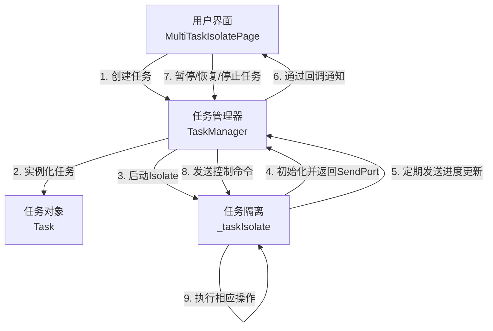

# isolate_stream_demo

一个基于Flutter Isolate的多任务并行处理与实时进度监听系统。该项目演示了如何在Flutter应用中使用Isolate实现真正的多线程任务处理，并提供任务的暂停、恢复、取消等完整生命周期管理功能。

## 系统架构与核心模块

系统采用模块化设计，清晰分离了数据模型、业务逻辑和UI展示：

- **Task类**：任务数据模型，包含任务ID、名称、进度、状态等属性
- **TaskManager类**：任务管理中心，负责任务的创建、启动、暂停、恢复和停止等全生命周期管理
- **_taskIsolate函数**：在独立Isolate中执行的任务函数，模拟耗时操作并报告进度
- **MultiTaskIsolatePage类**：UI界面，展示任务列表和提供任务控制功能

## 整体调用链路

### 核心模块交互流程



### 数据传递路径

1. **任务创建阶段**：
   - UI调用`TaskManager.startNewTask()`创建任务
   - TaskManager创建Task对象并启动Isolate
   - 通过Isolate.spawn传递初始数据（任务ID、初始进度、主线程SendPort）

2. **进度更新阶段**：
   - Isolate通过SendPort发送进度更新消息
   - TaskManager接收消息并更新任务状态
   - 通过回调函数通知UI更新

3. **任务控制阶段**：
   - UI触发暂停/恢复/停止操作
   - TaskManager通过保存的Isolate SendPort发送控制命令
   - Isolate接收命令并执行相应操作

### 关键调用顺序

```mermaid
flowchart TD
    subgraph 应用启动阶段
        A[main函数] --> B[MyApp|StatelessWidget]
        B --> C[MultiTaskIsolatePage|StatefulWidget]
        C -->|initState| D[TaskManager实例化]
    end

    subgraph 任务创建阶段
        E[用户点击"添加新任务"] --> F[_startNewTask()|UI方法]
        F --> G[TaskManager.startNewTask()|业务方法]
        G --> H[创建Task对象|数据模型]
        H --> I[_startTaskInIsolate()|启动隔离区]
        I --> J[Isolate.spawn|创建新Isolate]
        J --> K[配置消息监听|接收进度更新]
    end

    subgraph 任务执行与进度更新阶段
        L[_taskIsolate()|隔离区函数] --> M[初始化任务数据|随机参数]
        M --> N[发送命令端口|SendPort]
        N --> O[启动定时器|模拟任务执行]
        O -->|定期执行| P[更新任务进度|随机增加]
        P --> Q[通过SendPort发送进度|Map消息]
        Q --> R[TaskManager接收更新|处理消息]
        R --> S[更新Task对象状态|progress/completed]
        S -->|onTaskUpdate回调| T[setState(() {})|刷新UI]
    end

    subgraph 任务控制阶段
        U[用户点击暂停/恢复/停止] --> V[调用对应控制方法|pauseTask/resumeTask/stopTask]
        V --> W[通过保存的SendPort|发送控制命令]
        W --> X[Isolate接收命令|解析action]
        X --> Y[执行相应操作|更新状态/停止任务]
    end

    D --> G
    K --> L
    T --> U
    Y --> P
    S -->|onTaskComplete回调| T
```

## 设计方案分析

### 适用业务场景

- **后台耗时任务处理**：适合需要在后台执行的CPU密集型任务，如数据处理、文件解析等
- **多任务并行处理**：支持同时执行多个独立任务，提高系统整体效率
- **实时进度监控**：需要向用户展示任务进度的场景
- **任务生命周期管理**：需要对任务进行暂停、恢复、取消等操作的场景

### 技术优势

- **真正的并行处理**：使用Flutter Isolate实现，避免阻塞主线程和UI卡顿
- **双向通信机制**：实现了主线程与Isolate之间的双向通信，支持任务控制
- **模块化设计**：清晰分离了数据模型、业务逻辑和UI展示，便于维护和扩展
- **完善的资源管理**：提供了资源清理机制，避免内存泄漏
- **响应式UI**：任务状态变化实时反映到UI上，提供良好的用户体验

### 潜在限制

- **Isolate创建开销**：每个任务创建一个独立Isolate，在大量任务场景下可能消耗较多资源
- **通信开销**：Isolate间通信有一定的序列化/反序列化开销，不适合频繁大量的数据传输
- **内存占用**：每个Isolate有独立的内存空间，大量Isolate可能增加内存占用
- **任务类型限制**：更适合处理相对独立、无需频繁交互的任务

## 多任务调用优势

1. **提升系统吞吐量**：多个任务并行执行，充分利用设备多核性能

2. **优化用户体验**：UI线程不被阻塞，应用保持流畅响应

3. **任务隔离性**：一个任务的失败不会影响其他任务的执行

4. **精确控制**：支持对每个任务进行独立的暂停、恢复和停止操作

5. **灵活性**：任务可以独立配置执行参数和完成条件

## 快速开始

### 项目结构

```
lib/
├── main.dart         # 应用入口和UI实现
└── task_manager.dart # 任务模型和核心业务逻辑
```

### 运行项目

```bash
flutter run
```

### 使用说明

1. 点击右下角的"+"按钮添加新任务
2. 查看任务实时进度和状态
3. 对进行中的任务可以执行暂停/恢复操作
4. 点击关闭按钮停止单个任务
5. 点击右上角"清空"按钮停止所有任务

## 技术栈

- Flutter
- Dart Isolate API
- Stream API
- Provider模式（回调机制）

