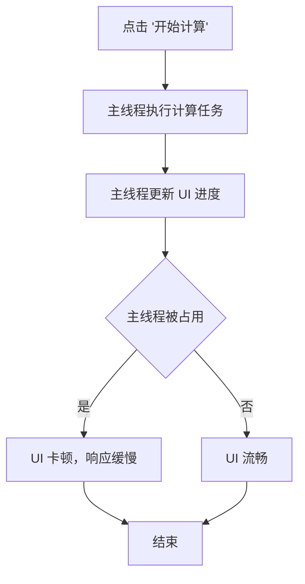
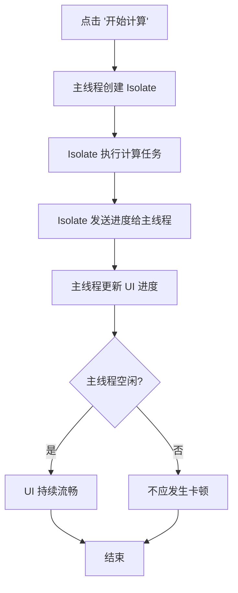

# isolate_test

A new Flutter project.

## Getting Started

This project is a starting point for a Flutter application.

A few resources to get you started if this is your first Flutter project:

- [Lab: Write your first Flutter app](https://docs.flutter.dev/get-started/codelab)
- [Cookbook: Useful Flutter samples](https://docs.flutter.dev/cookbook)

For help getting started with Flutter development, view the
[online documentation](https://docs.flutter.dev/), which offers tutorials,
samples, guidance on mobile development, and a full API reference.

## Isolate 特性对比演示

本项目通过 `WithoutIsolatePage` 和 `WithIsolatePage` 两个页面，演示在主线程和 Isolate 中执行同样的耗时计算时对 UI 响应的影响。

**示例流程：**
1. 点击"不使用 Isolate (卡顿示例)"按钮进入 `WithoutIsolatePage`。
2. 点击"开始计算"后，主线程执行大量素数计算，此时 UI 将出现明显卡顿。
3. 点击"点击测试响应"按钮和滑动动画区域，可以明显感知响应延迟。
4. 返回主页，点击"使用 Isolate (流畅示例)"进入 `WithIsolatePage`。
5. 点击"开始计算"后，通过 `Isolate.spawn` 在后台线程执行相同计算，UI 保持流畅。
6. 同样测试按钮和滑动动画，观察流畅度差异。

## 流程图对比

### 不使用 Isolate


### 使用 Isolate

[isolate](https://github.com/lizy-coding/flutter_study/blob/master/isolate_test/isolate.gif)

### 如何运行
```bash
flutter pub get
flutter run -d <your_device>
```

### 要点
- 理解 Flutter 主线程的单线程模型，避免在主线程执行耗时任务。
- 学习使用 `dart:isolate` 创建和管理 Isolate，实现并发计算。
- 掌握 `SendPort`/`ReceivePort` 跨 Isolate 通信机制。
- 对比主线程和 Isolate 中的性能和 UI 响应性差异。
