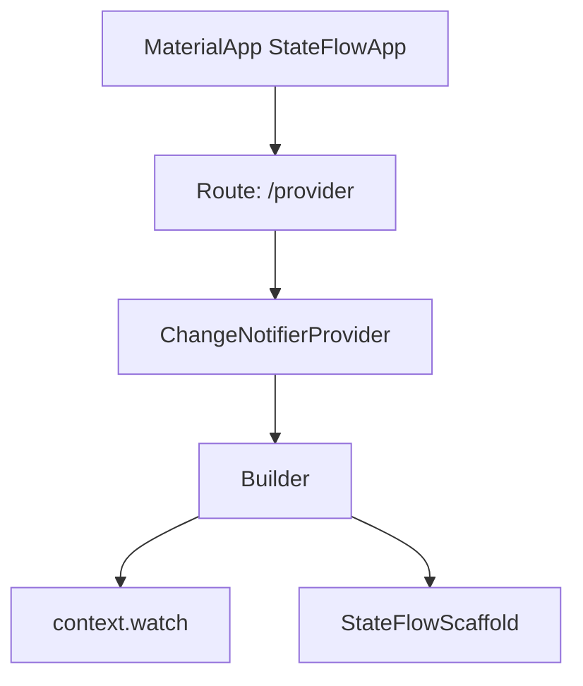
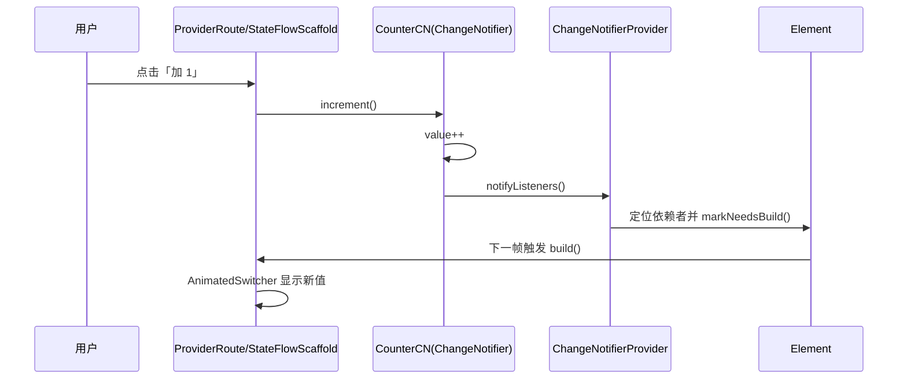
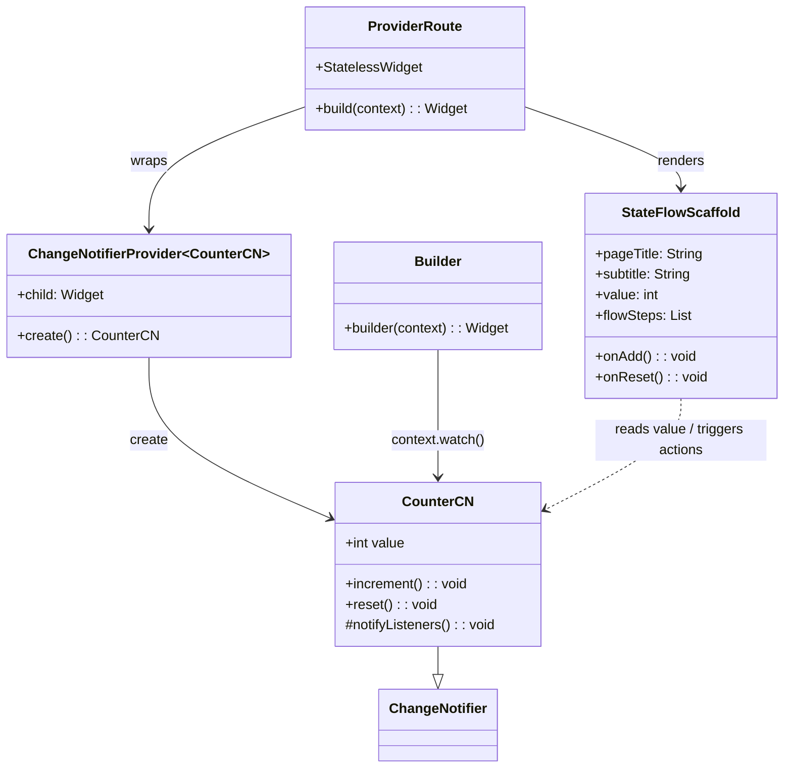
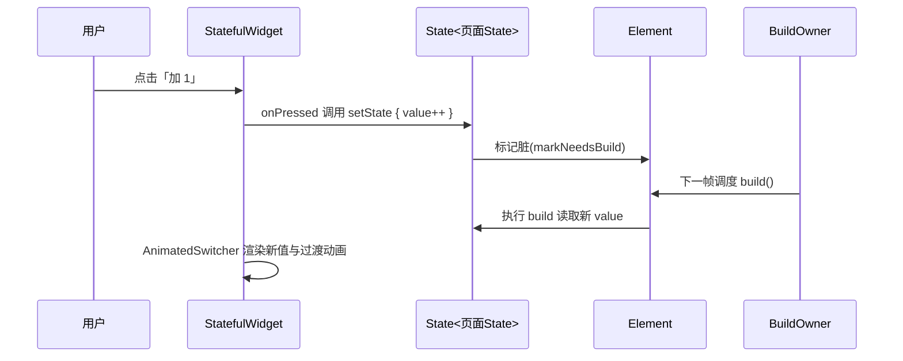

通过实现一个 demo 重新复习状态管理插件适用及追本溯源数据刷新原理，此章节先记录 Provider 的相关探索


## 项目分层 & 路由

```text
lib/
├── main.dart                                    # 仅负责挂 ProviderScope 与 StateFlowApp
├── app/state_flow_app.dart                      # MaterialApp + 首页卡片导航
├── features/
│   ├── provider/provider_route.dart             # ChangeNotifier 流程
│   └── riverpod/riverpod_route.dart             # StateNotifier / Riverpod 流程
└── shared/widgets/state_flow_scaffold.dart      # 统一 UI、动画、时间轴
```


## Provider 解析

Widget 路径


核心状态更新逻辑

```dart
class CounterCN extends ChangeNotifier {
  // ... existing code ...
  int value = 0;

  void increment() {
    final before = value;
    value++;
    debugPrint('[Provider] increment: $before -> $value');
    notifyListeners();
  }

  void reset() {
    value = 0;
    debugPrint('[Provider] reset -> 0');
    notifyListeners();
  }
  // ... existing code ...
}
```
### 一次完整的刷新

#### 刷新流
- `onPressed`（按钮） → `CounterCN.increment`
- `ChangeNotifier.notifyListeners`（模型发出通知）
- Provider 内部监听器捕获通知（由 `ChangeNotifierProvider` 注册）
- 定位订阅者并对对应 `Element` 执行 `markNeedsBuild`
- 下一帧：`build()` → `context.watch<CounterCN>()` 读取新状态 → UI 更新



#### 视图数据关系



### 关键代码定位与作用
>lib/features/provider/provider_route.dart

  - 关键节点 1（注册模型到树）：`ChangeNotifierProvider(create: (_) => CounterCN(), child: ...)`
    **作用**：将 `CounterCN` 注入到 Widget 树，并在内部订阅它的 `notifyListeners()`。
  - 关键节点 2（建立依赖）：`final counter = context.watch<CounterCN>();`            
    **作用**：在 `build()` 期间通过 `InheritedWidget` 收集依赖，记录“当前 Element 依赖于 `CounterCN`”。
  - 关键节点 3（触发通知）：`CounterCN.increment/reset -> notifyListeners()`         
    **作用**：触发 Provider 的监听队列，定位到依赖者并标记重建。


### 数据流讲解（基于当前项目）

- 初始化与依赖建立：
  - `ChangeNotifierProvider(create: () => CounterCN)` 构造 `CounterCN` 并在内部 `addListener` 订阅其变化。
  - `Builder` 的 `build()` 中调用 `context.watch<CounterCN>()`，通过 `InheritedWidget` 收集依赖，确立“此 Element 订阅 `CounterCN`”。
- 交互触发与状态变更：
  - 用户点击「加 1」按钮 → 调用 `CounterCN.increment()` → `value++`。
  - 紧接着 `notifyListeners()` 被调用，Provider 捕获到通知。
- 依赖定位与重建标记：
  - Provider 在其维护的依赖图中找到所有订阅 `CounterCN` 的 Element。
  - 对这些 Element 执行 `markNeedsBuild()`，等待下一帧统一重建。
- 下一帧重建与数据读取：
  - 框架在下一帧调度 `build()`，`context.watch<CounterCN>()` 返回最新 `value`。
  - `StateFlowScaffold` 因 `value` 变化重建，`AnimatedSwitcher` 展示新数值和过渡动画。
- 关键日志（可在控制台复现）：
  - `"[Provider] 创建 CounterCN，并开始监听 notifyListeners"`（注册阶段）
  - `"[Provider] UI build，读取 value=..."`（每次重建时读取）
  - `"[Provider] increment: X -> Y"`（状态变化）
  - `"[Provider] reset -> 0"`（重置状态）


## 与 setState 对比

### setState 数据流转


### 差异对比

| 维度 | setState（局部状态） | Provider（ChangeNotifier） | Riverpod（StateNotifier） |
| --- | --- | --- | --- |
| 状态存放 | Widget 内部（`State<T>`） | 外部模型（`ChangeNotifier`） | 容器 + 通知者（`ProviderScope` + `StateNotifier`） |
| 依赖声明 | 无订阅，自行控制刷新 | 隐式订阅（`context.watch/select`） | 显式订阅（`ref.watch`） |
| 通知方式 | `setState()` 当前 Element 重建 | `notifyListeners()` 广播到依赖者 | 容器记录 diff，广播到订阅者 |
| 常见坑 | 重建范围过大、回调闭包旧值 | 在回调中误用 `watch`、订阅过粗 | 滥用全局 Provider、作用域不清晰 |
| 适用场景 | 极简页面/一次性状态 | 中小型共享状态、快速上手 | 中大型项目、可测试与演进友好 |

### 解决了哪些问题（相对 setState）

- 将业务状态从 UI 中抽离，降低耦合度：
  - Provider：`CounterCN` 作为独立模型，UI 只订阅；
  - Riverpod：`StateNotifier` 更彻底将状态逻辑容器化。
- 明确重建边界，减少不必要的刷新：
  - Provider：通过 `watch/select` 精准订阅；
  - Riverpod：`Consumer` 与 `ref.watch` 精准控制订阅粒度。
- 跨组件的共享更自然：
  - Provider：把 Provider 提升到页面祖先即可共享；
  - Riverpod：作用域定义在 `ProviderScope`，可局部覆盖与隔离。
- 测试与演进更友好：
  - Provider：最小祖先树即可覆盖 UI 订阅；
  - Riverpod：`ProviderContainer` 脱离 UI 即可单测状态转换。
- 类型与 IDE 推断稳定：
  - Riverpod 的 `StateNotifierProvider<Notifier, State>` 显式泛型，复杂场景更清晰。
- 可观察性强：
  - 结合 `StateFlowScaffold` 的时间轴与 `debugPrint` 日志，完整复盘“事件 → 状态 → 通知 → build() 重建 → 展示”。

> 何时仍用 `setState`：极简页面、一次性局部交互（无需共享与复用），或原型期快速验证。进入共享/跨组件/可测试/可演进需求时，优先 Provider/Riverpod。


