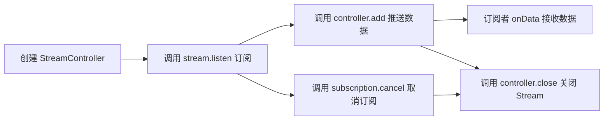

# Flutter Stream 学习项目

这个项目用于学习 Flutter 中的 Stream 特性，帮助理解流式编程模型以及如何在 Flutter 应用中使用 Stream。

## 项目结构

该项目包含以下核心功能：

- **单订阅 Stream 示例**：演示单订阅流（Single-subscription Stream）的特性和用法
- **广播 Stream 示例**：演示广播流（Broadcast Stream）的特性和用法
- **Stream 变换工具**：提供各种 Stream 操作和变换的工具方法

## 核心概念

### Stream 是什么？

Stream 是 Flutter/Dart 中处理异步数据流的核心工具，其流式推送机制通过持续发送数据事件实现动态响应。Stream 提供了一种处理异步事件序列的方式，使你能够监听和响应连续发生的事件。

### 单订阅流 vs 广播流

- **单订阅流（Single-subscription Stream）**：只允许一个监听器，一旦被订阅后就不能再添加其他订阅者，适用于点对点通信场景。
- **广播流（Broadcast Stream）**：允许多个监听器，在任何时刻都可以添加新的订阅者，适用于一对多通信场景。

### StreamController

StreamController 是创建和管理 Stream 的控制器，它提供了向 Stream 中添加数据和错误的方法，以及关闭 Stream 的能力。

### StreamSubscription

StreamSubscription 表示对 Stream 的订阅，通过它你可以暂停、恢复和取消订阅，以及处理接收到的数据和错误。

## 如何使用

1. 启动应用
2. 在主页面选择想要学习的 Stream 示例
3. 通过操作界面理解 Stream 的工作原理

## 扩展计划

本项目将持续添加更多 Stream 学习场景，包括：

- Stream 变换操作示例
- Stream 与其他 Flutter 组件的集成
- 实际应用场景中的 Stream 使用案例

## 学习资源

- [Dart 官方文档 - Stream](https://dart.dev/tutorials/language/streams)
- [Flutter 官方文档 - 异步编程](https://flutter.dev/docs/development/data-and-backend/networking)

## 流程图

### 单订阅 Stream 流程



### 广播 Stream 流程

```mermaid
flowchart LR
  flowchart LR
  A[创建 broadcast StreamController] --> B1[订阅者1 调用 stream.listen]
  A --> B2[订阅者2 调用 stream.listen]
  C[调用 controller.add 推送数据] --> D1[订阅者1 onData 接收数据]
  C --> D2[订阅者2 onData 接收数据]
  B1 --> E[调用 controller.close 关闭 Stream]
  B2 --> E
```
