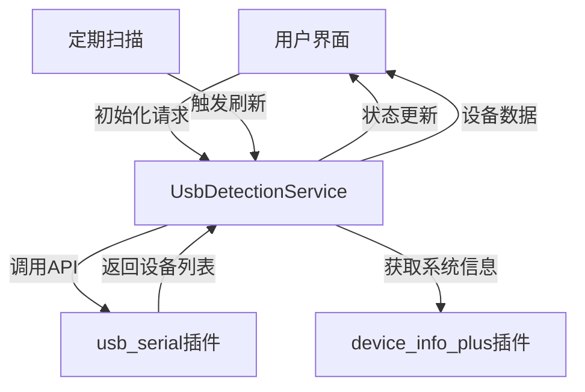

# Flutter PC项目中USB设备检测实现指南

## 一、需求背景与分析

在Flutter桌面(PC)应用开发中，USB设备检测是一个常见但具有挑战性的需求。特别是在以下场景中尤为重要：
- 工业控制与自动化应用
- 硬件调试工具
- 物联网设备管理
- 数据采集与传输系统

PC平台(Windows、macOS、Linux)对USB设备的访问机制存在差异，这给跨平台的Flutter应用带来了挑战。本指南将详细介绍如何在Flutter PC项目中实现USB设备检测功能。

## 二、插件选型分析

### 2.1 为什么选择`usb_serial`插件？

在评估了多个可能的解决方案后，本项目选择了`usb_serial` ^0.5.0插件，主要基于以下理由：

| 选型因素 | `usb_serial`优势 | 其他方案不足 |
|---------|----------------|-------------|
| 跨平台支持 | 支持Windows、macOS和Linux | 许多USB插件仅支持移动平台 |
| 易用性 | API设计直观，易于集成 | 某些原生API封装复杂 |
| 社区活跃度 | 持续更新维护 | 部分插件已停止更新 |
| 功能完整性 | 支持设备列表获取、连接和通信 | 部分轻量级插件功能有限 |
| 权限处理 | 内置基本的权限处理机制 | 需自行实现复杂的权限逻辑 |

### 2.2 辅助插件选择

除`usb_serial`外，项目还集成了`device_info_plus` ^10.1.2插件，用于获取当前操作系统信息，帮助更好地处理平台差异性。

## 三、实现架构与核心代码解析

### 3.1 整体架构设计

本项目采用分层架构实现USB设备检测功能：
- **服务层**：`UsbDetectionService`类负责核心检测逻辑
- **模型层**：`UsbDeviceInfo`类定义设备信息结构
- **UI层**：`MyHomePage`组件负责界面展示与交互



### 3.2 核心服务实现

`UsbDetectionService`类是整个USB检测功能的核心，采用单例模式实现：

```dart
class UsbDetectionService {
  static final UsbDetectionService _instance = UsbDetectionService._internal();
  factory UsbDetectionService() => _instance;
  UsbDetectionService._internal();
  
  // 成员变量...
  
  Future<bool> initialize() async {
    try {
      _statusStreamController.add('正在初始化USB服务...');
      // USB Serial 不需要显式初始化
      _isInitialized = true;
      
      if (_isInitialized) {
        _statusStreamController.add('USB服务初始化成功');
        await _refreshDeviceList();
        _startPeriodicScanning();
      }
      // ...
    }
    // ...
  }
  
  // 其他方法...
}
```
<mcfile name="usb_detection_service.dart" path="/Users/zzy/Desktop/flutter_study/usb_detector_demo/lib/services/usb_detection_service.dart"></mcfile>

该服务主要包含以下关键功能：

1. **设备扫描机制**：通过`_refreshDeviceList()`方法获取连接的USB设备列表
   ```dart
   Future<void> _refreshDeviceList() async {
     if (!_isInitialized) return;
     
     try {
       _statusStreamController.add('正在扫描USB设备...');
       List<UsbDevice> devices = await UsbSerial.listDevices();
       List<UsbDeviceInfo> deviceInfoList = [];
       
       // 处理设备信息...
       
       _connectedDevices = deviceInfoList;
       _deviceStreamController.add(_connectedDevices);
       
       _statusStreamController.add('发现 ${_connectedDevices.length} 个USB设备');
     }
     // ...
   }
   ```

2. **定期检测功能**：通过定时器实现设备状态的持续监控
   ```dart
   void _startPeriodicScanning() {
     _periodicTimer?.cancel();
     _periodicTimer = Timer.periodic(
       const Duration(seconds: 3),
       (timer) => _refreshDeviceList(),
     );
   }
   ```

3. **事件流通信**：使用StreamController实现UI与服务层的解耦
   ```dart
   final StreamController<List<UsbDeviceInfo>> _deviceStreamController = 
       StreamController<List<UsbDeviceInfo>>.broadcast();
   
   final StreamController<String> _statusStreamController = 
       StreamController<String>.broadcast();
   ```

### 3.3 设备信息模型

`UsbDeviceInfo`类定义了USB设备的数据结构，并提供了一些辅助方法：

```dart
class UsbDeviceInfo {
  final int vendorId;
  final int productId;
  final String? manufacturer;
  final String? product;
  final String? serialNumber;
  final UsbDeviceStatus status;
  final DateTime lastSeen;
  
  // 构造函数...
  
  String get displayName {
    // 生成显示名称...
  }
  
  String get deviceId => '${vendorId.toRadixString(16).padLeft(4, '0')}:${productId.toRadixString(16).padLeft(4, '0')}'.toUpperCase();
}
```
<mcfile name="usb_device_info.dart" path="/Users/zzy/Desktop/flutter_study/usb_detector_demo/lib/models/usb_device_info.dart"></mcfile>

### 3.4 UI层集成

在主界面`MyHomePage`中，通过状态管理与服务层进行交互：

```dart
class _MyHomePageState extends State<MyHomePage> {
  final UsbDetectionService _usbService = UsbDetectionService();
  List<UsbDeviceInfo> _devices = [];
  String _statusMessage = '正在初始化...';
  // ...
  
  Future<void> _initializeUsb() async {
    bool initialized = await _usbService.initialize();
    String systemInfo = await _usbService.getSystemInfo();
    
    setState(() {
      _isInitialized = initialized;
      _systemInfo = systemInfo;
    });
    
    // 监听设备和状态变化
    _usbService.deviceStream.listen((devices) {
      setState(() {
        _devices = devices;
      });
    });
    
    _usbService.statusStream.listen((status) {
      setState(() {
        _statusMessage = status;
      });
    });
  }
}
```
<mcfile name="main.dart" path="/Users/zzy/Desktop/flutter_study/usb_detector_demo/lib/main.dart"></mcfile>

## 四、使用流程与最佳实践

### 4.1 基本使用流程

1. **添加依赖**
   ```yaml
   dependencies:
     usb_serial: ^0.5.0
     device_info_plus: ^10.1.2
   ```

2. **初始化服务**
   ```dart
   final UsbDetectionService _usbService = UsbDetectionService();
   await _usbService.initialize();
   ```

3. **监听设备变化**
   ```dart
   _usbService.deviceStream.listen((devices) {
     // 处理设备列表更新
   });
   ```

4. **手动刷新设备**
   ```dart
   await _usbService.refreshDevices();
   ```

### 4.2 最佳实践

1. **服务生命周期管理**
   - 在Widget的`initState()`中初始化服务
   - 在`dispose()`中释放资源，避免内存泄漏
   ```dart
   @override
   void dispose() {
     _usbService.dispose();
     super.dispose();
   }
   ```

2. **错误处理机制**
   - 对异步操作进行try-catch包装
   - 提供友好的错误提示给用户

3. **定期扫描间隔调整**
   - 根据应用需求调整扫描频率，避免过高频率影响性能
   ```dart
   _periodicTimer = Timer.periodic(
     const Duration(seconds: 3), // 可根据需求调整
     (timer) => _refreshDeviceList(),
   );
   ```

4. **权限处理**
   - 在需要时提示用户授予USB设备访问权限
   - 处理权限被拒绝的情况

## 五、平台兼容性与注意事项

### 5.1 平台特定配置

**Windows平台**:
- 需要安装正确的USB驱动
- 可能需要以管理员权限运行应用

**macOS平台**:
- 需要在Info.plist中添加USB设备权限声明
- 可能需要在系统偏好设置中允许应用访问USB设备

**Linux平台**:
- 可能需要配置udev规则以允许非root用户访问USB设备
- 部分Linux发行版可能需要额外的系统包

### 5.2 性能优化

- 避免在UI线程中执行耗时的USB操作
- 使用缓存减少重复扫描
- 考虑使用节流机制限制扫描频率

### 5.3 常见问题与解决方案

| 问题 | 可能原因 | 解决方案 |
|-----|---------|---------|
| 无法检测设备 | 驱动未安装或权限不足 | 安装驱动，检查权限设置 |
| 设备信息不完整 | 设备未提供完整描述符 | 添加默认信息处理逻辑 |
| 性能问题 | 扫描频率过高 | 降低扫描频率，优化处理逻辑 |
| 平台差异 | 各平台实现细节不同 | 添加平台特定的处理代码 |

## 六、总结

本指南详细介绍了在Flutter PC项目中实现USB设备检测的完整流程，包括插件选型、架构设计、核心代码实现和最佳实践。通过使用`usb_serial`插件并结合适当的架构设计，可以有效地解决Flutter桌面应用中的USB设备检测需求，为工业控制、硬件调试、物联网等场景提供可靠的技术支持。

通过采用单例模式的服务设计、事件流通信机制和定期扫描策略，可以构建出高性能、可维护的USB设备检测功能，同时保持良好的用户体验。在实际应用中，还需要根据具体需求和平台特性进行适当的调整和优化。