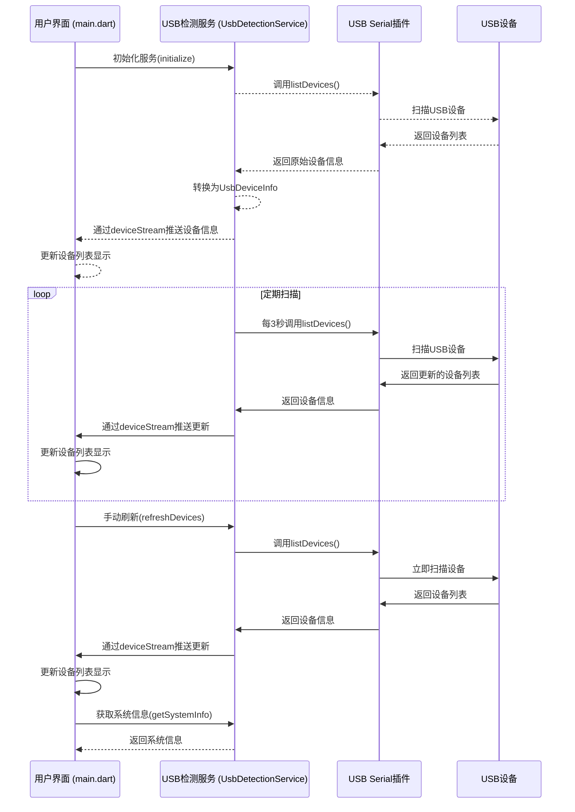

# USB设备检测器

## 项目概述

这是一个基于Flutter开发的USB设备检测应用，用于实时监控和显示连接到设备上的USB设备信息。该应用能够定期扫描USB设备，获取设备的厂商ID、产品ID、制造商、产品名称和序列号等关键信息，并以直观的界面展示给用户。

## 项目结构

```
├── lib/
│   ├── main.dart               # 应用入口和主界面
│   ├── models/
│   │   └── usb_device_info.dart  # USB设备信息模型
│   └── services/
│       └── usb_detection_service.dart # USB设备检测服务
├── android/                    # Android平台相关代码
├── ios/                        # iOS平台相关代码
├── macos/                      # macOS平台相关代码
├── windows/                    # Windows平台相关代码
└── pubspec.yaml                # 项目依赖配置
```

项目采用了清晰的分层架构：
- **models层**：定义数据结构，如`UsbDeviceInfo`类
- **services层**：提供业务逻辑，如`UsbDetectionService`负责USB设备检测和管理
- **UI层**：在`main.dart`中实现用户界面和交互

## USB设备检测插件调用流程

以下是插件的整体调用流程，通过Mermaid图表展示：



## 核心调用策略

### 1. 服务初始化与单例模式

USB检测服务采用单例模式设计，确保全局只有一个服务实例在运行：

```dart
class UsbDetectionService {
  static final UsbDetectionService _instance = UsbDetectionService._internal();
  factory UsbDetectionService() => _instance;
  UsbDetectionService._internal();
  // ...
}
```

初始化过程通过`initialize()`方法完成，主要步骤包括：
- 设置初始化状态标志
- 添加初始状态消息到状态流
- 执行首次设备扫描
- 启动定期扫描计时器

### 2. 设备信息获取与转换

设备信息获取主要通过以下步骤：
1. 调用`UsbSerial.listDevices()`获取原始设备列表
2. 将每个原始`UsbDevice`对象转换为自定义的`UsbDeviceInfo`模型
3. 通过StreamController将设备信息推送到UI层

```dart
Future<void> _refreshDeviceList() async {
  List<UsbDevice> devices = await UsbSerial.listDevices();
  List<UsbDeviceInfo> deviceInfoList = [];
  
  for (UsbDevice device in devices) {
    UsbDeviceInfo deviceInfo = UsbDeviceInfo(
      vendorId: device.vid ?? 0,
      productId: device.pid ?? 0,
      manufacturer: device.manufacturerName,
      product: device.productName,
      serialNumber: device.serial,
      status: UsbDeviceStatus.connected,
    );
    deviceInfoList.add(deviceInfo);
  }
  
  _connectedDevices = deviceInfoList;
  _deviceStreamController.add(_connectedDevices);
}
```

### 3. 定期扫描机制

为了实时监控USB设备的连接状态，实现了定期扫描机制：

```dart
void _startPeriodicScanning() {
  _periodicTimer?.cancel();
  _periodicTimer = Timer.periodic(
    const Duration(seconds: 3),
    (timer) => _refreshDeviceList(),
  );
}
```

这确保了应用每3秒自动扫描一次USB设备，保持设备列表的实时更新。

### 4. 事件流通信机制

服务层与UI层之间采用Stream通信机制，实现了松耦合的数据传递：

```dart
// 在服务层定义StreamController
final StreamController<List<UsbDeviceInfo>> _deviceStreamController = 
    StreamController<List<UsbDeviceInfo>>.broadcast();
final StreamController<String> _statusStreamController = 
    StreamController<String>.broadcast();

// 提供Stream供UI层监听\Stream<List<UsbDeviceInfo>> get deviceStream => _deviceStreamController.stream;
Stream<String> get statusStream => _statusStreamController.stream;
```

在UI层通过监听器接收数据更新：

```dart
_usbService.deviceStream.listen((devices) {
  setState(() {
    _devices = devices;
  });
});

_usbService.statusStream.listen((status) {
  setState(() {
    _statusMessage = status;
  });
});
```

## usb_serial插件调用原理

### 基本原理

`usb_serial`插件是一个跨平台的Flutter插件，用于访问USB串行设备。它的核心调用原理如下：

1. **平台适配层**：插件为不同平台（Android、iOS、macOS、Windows）提供了特定的实现代码
2. **权限管理**：处理USB设备访问所需的各种权限请求
3. **设备枚举**：通过各平台的API扫描并枚举连接的USB设备
4. **数据转换**：将平台特定的设备信息转换为统一的Dart对象供Flutter应用使用

### 核心API调用

该项目主要使用了`usb_serial`插件的以下核心API：

1. **`UsbSerial.listDevices()`**：获取当前连接的所有USB设备列表
   - 返回类型：`Future<List<UsbDevice>>`
   - 功能：扫描系统中已连接的USB设备并返回其基本信息

2. **`UsbDevice`类**：代表一个USB设备，提供以下主要属性：
   - `vid`：厂商ID（Vendor ID）
   - `pid`：产品ID（Product ID）
   - `manufacturerName`：制造商名称
   - `productName`：产品名称
   - `serial`：设备序列号

3. **连接和通信API**（项目中未直接使用，但为完整功能准备）：
   - `open()`：打开与设备的连接
   - `close()`：关闭与设备的连接
   - `write()`：向设备发送数据
   - `inputStream`：接收来自设备的数据的流

## 项目依赖

主要依赖包：

```yaml
dependencies:
  flutter:
    sdk: flutter
  usb_serial: ^0.5.0
  device_info_plus: ^9.1.0
```

- **`usb_serial`**：提供USB设备检测和通信功能
- **`device_info_plus`**：获取设备系统信息

## 运行项目

### 前置条件

1. 安装Flutter SDK（推荐最新稳定版）
2. 安装Dart SDK
3. 配置相应平台的开发环境（Android Studio、Xcode等）

### 运行步骤

1. 克隆或下载项目代码
2. 在项目根目录运行以下命令安装依赖：
   ```bash
   flutter pub get
   ```
3. 运行应用：
   ```bash
   flutter run
   ```

## 平台兼容性

该应用支持以下平台：
- Android
- iOS（受限于iOS平台的USB访问限制）
- macOS
- Windows

## 注意事项

1. **权限问题**：在某些平台上可能需要手动授予USB设备访问权限
2. **iOS限制**：iOS设备对USB设备的访问有严格限制，可能需要使用MFi认证的设备
3. **设备信息完整性**：并非所有USB设备都能提供完整的制造商、产品名称和序列号信息
4. **周期性扫描**：当前设置为每3秒扫描一次，可能会根据实际需求调整频率

## 扩展与优化方向

1. 添加USB设备的连接和通信功能
2. 实现设备过滤和自定义监控规则
3. 支持设备连接历史记录
4. 优化耗电和性能，减少不必要的扫描
5. 添加更多设备详细信息和属性显示
